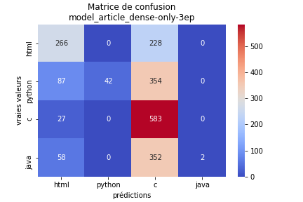
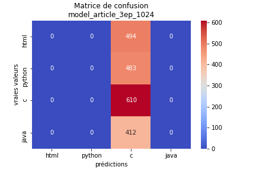
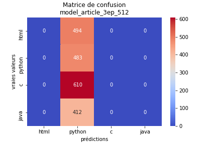
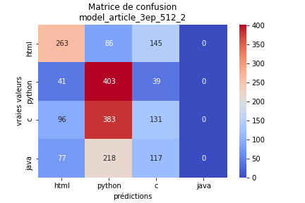
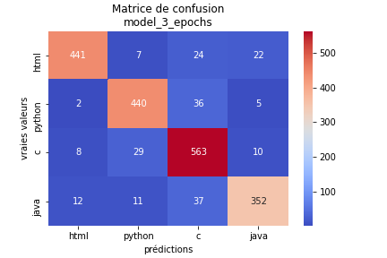
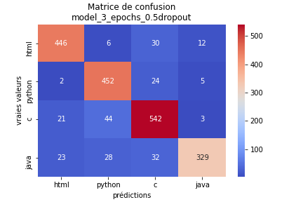
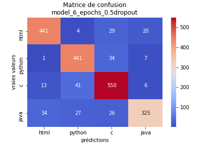

<font size="8">  __Classification de langages de programmation à l'aide d'un CNN__</font>

---

- [1. Introduction](#1-introduction)
- [2. Demonstration: let's use our classifier !](#2-demonstration--let-s-use-our-classifier--)
- [3. Technical details](#3-technical-details)
  - [3.1. Global architecture and preprocessing](#31-global-architecture-and-préprocessing)
  - [3.2. CNN Architecture](#32-cnn-architecture)
  - [3.3. Model tuning & hyper-parameters](#33-model-tuning--hyper-paramètres)
  - [3.4 Dataset](#34-dataset)
  - [3.5. Results](#35-results)
- [4. Summary of the research article](#4-summary-of-the-research-article)
  - [4.1. Presentation of the article](#41-présentation-of-the-article)
  - [4.2. Goals](#42-goals)
  - [4.3. Model construction](#43-Model-construction)
    - [4.3.1. Entering and Quantizing Characters](#431-Entering-and-quantitizing-characters)
    - [4.3.2. The neural network](#432-the-neural-network)
  - [4.4. Data augmentation](#44-data-augmentation)
  - [5.5. Comparisons and results](#55-comparisons-and-results)

# 1. Introduction

Dans ce projet, nous avons créé un classifieur de langages de programmation pouvant prédire les 4 langages **C**, **html**, **python** et **Java**, dont la longueur est supérieure ou égale à 1024 caractères.

Notre avons effectué cela avec une approche originale, étant donné que nous nous sommes basés sur un **CNN** avec une **tokenisation par caractère**, contrairement à la norme qui est plutôt d'utiliser des RNN/LSTM.

Cette approche s'appuie sur celle présentée dans le papier de recherche [Character-level Convolutional Networks for Text Classification](#11-présentation-de-larticle), sans pour autant y être très fidèle, et que nous avons adapté à la classification de langages de programmation. Nous souhaitions une approche par caractère, étant donné que les tokenisations disponibles et fréquentes dans la littérature sont basés pour analyser des textes dans les langues naturelles, et non celles des langages de programmation.

# 2. Demonstration: let's use our classifier !

Vous pouvez utiliser notre classifieur et faire des prédictions sur un script (C, html, java ou python) de plus de 1024 caractères :

- Clonez le projet :

```
$git clone https://gitlab.insa-rouen.fr/lwannenmacher/projetml.git
```

- Lancez le script python *predict_a_langage.py* :

```
$python3 predict_a_langage.py votre_fichier
```

# 3. Technical details

Nous vous conseillons de lire le [résumé de l'article de recherche](#4-résumé-de-larticle-de-recherche) que nous avons mis à la fin de ce document avant de lire cette partie.

## 3.1. Global architecture and preprocessing

En entrée, nous avons **une chaine de caractères** (un script java, C, python ou html) de **taille supérieure ou égale à 1024 caractères**. Cette chaine de caractères est coupée de manière à conserver uniquement les 1024 premiers caractères : cela permet à notre CNN d'avoir une entrée de taille fixe.

Les caractères sont ensuite traduits en chiffres grâce à un dérivé de la table ASCII, qui traite 101 caractères différents, dont par exemple les tabulations ou retours chariots, qui sont importants dans notre cas. Puis, ils sont **quantifiés** avec la méthode one-hot encoding, et cela est vectorisé et binarisé. À ce stade, chaque script est donc encodé dans **une matrice 2D** binaire de taille **1024*101** : 1024 étant la taille du fichier et 101 étant le nombre de caractères différents possibles.

## 3.2. CNN Architecture

- __Le modèle de l'article__

Nous avons tout d'abord essayé de reproduire à l'identique le modèle proposé dans l'article de recherche. Leurs implémentation avait été réalisée sur __Torch 7__ mais comme nous n'y avions pas accès, nous avons dû nous baser uniquement sur leur document.

- __Le modèle de notre approche__

Nous avons réalisé un second modèle : un CNN effectuant des convolutions 2D et non 1D comme dans l'article, permettant alors de traiter le problème de manière similaire à de la classification d'images en niveaux de gris. C'est là toute l'originalité de notre approche.
Pour cela une dernière étape de préprocessing est nécessaire. Elle augmente artificiellement la dimension de notre matrice pour l'amener à **(1024,101,1)**.

Notre modèle est composé de 3 couches de convolutions 2D avec 2 couches de Max Pooling intercalées. On retrouve à la suite de cela deux couches denses pour la classification avec un dropout entre les deux.

## 3.3. Model tuning & hyper-parameters

Afin d'obtenir les meilleurs performances, nous pouvons jouer sur les hypers-paramètres de nos modèles ou même modifier ces derniers.

On peut notamment jouer sur :

- la probabilité de dropout
- le nombre de caractères pris en compte dans chaque fichier
- le nombre d'epochs lors de l'apprentissage
- le taux d'apprentissage

## 3.4 Dataset

Le dataset que nous utilisons contient des milliers de fichiers de différents langages. Ils représentent au total __150 Mo__ de données et __238 000 échantillons__. Les langages sont les suivants :

- bash
- c
- c#
- c++
- css
- haskell
- html
- java
- javascript
- lua
- markdown
- objective-c
- perl
- php
- python
- r
- ruby
- scala
- sql
- swift
- vb.net

Nous avons décidé d'en choisir uniquement 4 : c, html, java et python, afin de rendre les apprentissages plus simples pour notre projet. On pourrait très bien imaginer par la suite ajouter d'autres langages.  
Beaucoup des fichiers présents dans le dataset ont une taille inférieure à 1024 caractères. Ainsi, une des étapes du préprocessing consiste en un filtrage de ces fichiers trop petits. Finalement nous nous retrouvons avec environ 1500 fichiers échantillons pour chacun des 4 langages.

## 3.5. Results

Voici les résultats pour les différents modèles que nous avons testés. Nous retrouvons pour chaque modèle ses caractéristiques, la valeur de la précision sur le jeu de test ainsi que la matrice de confusion obtenue. Nous avons effectué tous les calculs sur le même jeu de test pour que la comparaison soit cohérente.

- ### __Le modèle de l'article__

  - model_article_dense-only-3ep

      Caractéristiques :

    - couche dense uniquement
    - caractères : 1024
    - epoch : 3

      Accuracy : 44.67 %

      

      ---

  - model_article_3ep_1024

      Caractéristiques :

    - caractères : 1024
    - epoch : 3

      Accuracy : 30.52 %

      

      ---

  - model_article_3ep_512

      Caractéristiques :

    - caractères : 512
    - epoch : 3

      Accuracy : 24.16 %

      

      ---

  - model_article_3ep_512_2

      Caractéristiques :

    - caractères : 512
    - epoch : 3

      Accuracy : 39.87 %

      

      ---

  - model_article_3ep_256_0.001lr

      Caractéristiques :

    - caractères : 256
    - epoch : 3
    - taux d'apprentissage : 0.001

      Accuracy : 24.16 % %

      

---

- ### __Le modèle de notre approche__

  - model_3_epochs

      Caractéristiques :

    - caractères : 1024
    - epoch : 3

      <!-- Accuracy : 89.84 % -->
      <!-- Accuracy : 88.64 % -->
      Accuracy : 80.56 %

      

      ---

  - model_3_epochs_0.5dropout

      Caractéristiques :

    - caractères : 1024
    - epoch : 3
    - dropout : 50 %

      <!-- Accuracy : 88.49 % -->
      <!-- Accuracy : 88.49 % -->
      Accuracy : 80.24 %

      

      ---

  - model_6_epochs_0.5dropout

      Caractéristiques :

    - caractères : 1024
    - epoch : 6
    - dropout : 50 %

      <!-- Accuracy : 87.89 % -->
      <!-- Accuracy : 88.69 % -->
      Accuracy : 84.70 %

      

      ---

Pour conlure, les résultats que nous obtenons avec le dernier modèle montrent une précision de 84.70 % , ce qui est satisfaisant pour le projet et permet de classifier correctement la majorité des codes que l'on pourrait lui proposer.

# 4. Summary of the research article

## 4.1. Présentation de l'article

L'article de recherche s'intitule "__Character-level Convolutional Networks for Text
Classification__". Il a été publié le __16 Avril 2016__ et écrit par __Xiang Zhang__, __Junbo Zhao__ et __Yann LeCun__ de l'__Institut Courant de sciences mathématiques__ de l'__Université de New York__.

## 4.2. Goals

Cet article propose une exploration empirique de l'utilisation des réseaux de neurones convolutifs (CNN) au niveau des caractères pour la classification de textes.

Les auteurs indiquent qu'il y avait déjà à ce moment beaucoup d'articles sur l'utilisation de CNN sur des mots pour de la classification de texte et quelques travaux sur une utilisation des caractères mais toujours avec une base d'apprentissage sur des mots. Cependant, cet article est le premier qui traite de CNN se basant uniquement sur les caractères. Cela permet, en plus de ne pas avoir besoin de comprendre la structure syntaxique et sémantique d'une langue, d'abstenir la machine de la compréhension des mots.  
Le fait de travailler uniquement sur les caractères présente également un avantage sur les combinaisons de caractères anormales, telles que les fautes d'orthographe et les émoticônes, qui peuvent être naturellement apprises.

## 4.3. Model construction

### 4.3.1. Entering and Quantizing Characters

Tout commence avec du texte en entrée ayant deux tailles définies : 1024 et 256. Les caractères vont être __quantifiés__ avec la méthode "one-hot". L'alphabet est le suivant :

`abcdefghijklmnopqrstuvwxyz0123456789-,;.!?:’’’/\|_@#$%ˆ&*˜‘+-=<>()[]{}`

Il contient 70 caractères, les vecteurs sont donc de taille 70.

En entrée du modèle nous avons donc une matrice de soit __70\*1024__ ou soit __70\*256__.

### 4.3.2. The neural network

Le réseau a une profondeur de 9 avec __6 couches de convolution__ puis __3 denses__. Il s'agit de convolutions à une dimension avec du __max-pooling__ temporel. 2 __dropout__ sont placés entre les 3 couches denses avec une probabilité de 0,5.

L'apprentissage se fait grâce à une __descente de gradient stochastique__ avec __mini-lots__ de taille 128. Le pas initial est de 0,01 et est divisé par deux toutes les 3 époques (epoch), 10 fois.

Les poids sont initialisés avec une __distribution gaussienne__ avec une moyenne de 0 et un écart-type de 0,02 pour 1024 caractères et 0,05 pour 256.

L'implémentation a été réalisée avec Torch 7.

## 4.4. Data augmentation

Les auteurs nous expliquent que l'"augmentation de données" est utile pour contrôler l'erreur de généralisation. Cependant pour du texte c'est compliqué d'appliquer les mêmes méthodes que pour l'imagerie et demander à des hommes de reformuler le texte est inenvisageable avec le grand nombre de données. Le choix qui est fait ici est de remplacer certains mots par leurs synonymes aléatoirement en utilisant des distributions géométriques avec un paramètre déterminant la probabilité de remplacer un mot et un autre déterminant le synonyme qui va être utilisé.

## 5.5. Comparisons and results

Les chercheurs ont comparé les erreurs de tests obtenus avec ce modèle avec des méthodes traditionnelles comme le "__Sac de mots__", "__Sac de n-grammes__" ou "__k-moyennes sur plongement lexical__" et avec des modèles de deep learning comme des **CNN** et un **LSTM** basés sur les **mots**.  
Bien sur les tests ont été effectués dans des conditions similaires pour faire des comparaisons.  
Ils ont aussi essayé de changer l'alphabet en prenant en compte les majuscules mais ça apportait en général de moins bons résultats avec pour cause probable que ça ne change rien à la sémantique de la phrase.  
Ils ont nourri ces différentes techniques avec 8 datasets de tailles différentes allant de la centaine de millier à plusieurs millions d'échantillons.

Les résultats montrent que leur CNN sur les caractères est la méthode la plus efficace sur les grands datasets (à partir d'environ 1 million d'échantillons pour l'entrainement). En dessous c'est la méthode traditionnelle de sac de n-gramme qui semble la mieux.  
Les auteurs remarquent que leur modèle semble faire moins d'erreurs que les autres sur des données brutes générées par des utilisateurs, pouvant donc comporter des erreurs de langue. Cette méthode aurait donc plutôt des applications dans le monde réel.

La conclusion la plus importante de ces expériences est que les CNN au niveau des caractères peuvent fonctionner pour la classification de textes sans avoir besoin de la connaissance des mots. Cela indique que le langage peut être considéré comme un signal qui n'est pas différent de tout autre type de signal.

Ils prennent le soin de préciser à nouveau que cette méthode n'offre pas de solution standard à tous les problèmes mais qu'il faut faire un choix selon la situation.
